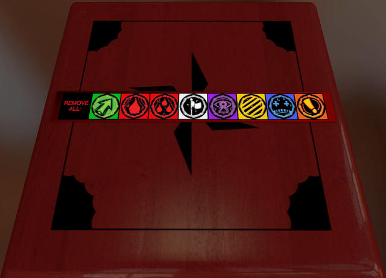

# OnePageRules Tokens Remover

[Get it on Steam Workshop](https://steamcommunity.com/sharedfiles/filedetails/?id=2877511993)



A Tabletop Simulator mod adding a bunch of buttons for removing [OPR](https://onepagerules.com/)
tokens of a particular type from the table, e.g. for clearing all activation or melee markers
when the round ends.

Intended for use with [FTC Grimdark Future OPR Map Base](https://steamcommunity.com/sharedfiles/filedetails/?id=2732252928)
and other mods incorporating [OnePageRules Tokens](https://steamcommunity.com/sharedfiles/filedetails/?id=2294492602),
this mod was also tested to work against:

*   BadSkeel'z OnePageRules Grimdark Future Board
*   OPR Age of Fantasy Penultimate Table
*   OPR Base Table
*   OPR Table: Grimdark Future and Age of Fantasy
*   Grimdark Future v2.16 - v2.0
*   Grimdark Future Game-ready table
*   Grimdark Future v2.16 - RTP (Ready to play)

## Development

If you are on linux, make sure you have make and npm installed, then run `make build`.
Build results will be saved to `./dist`.
Running `make publish` will copy the files to your TTS saved objects directory.

If you use another operating system, install docker, then run:

```
docker build -t tts-opr-tokens-remover-builder .;
docker run -it  --volume ${PWD}/src:/build/src --volume ${PWD}/Makefile:/build/Makefile --volume ${PWD}/dist:/build/dist:rw tts-opr-tokens-remover-builder
```
